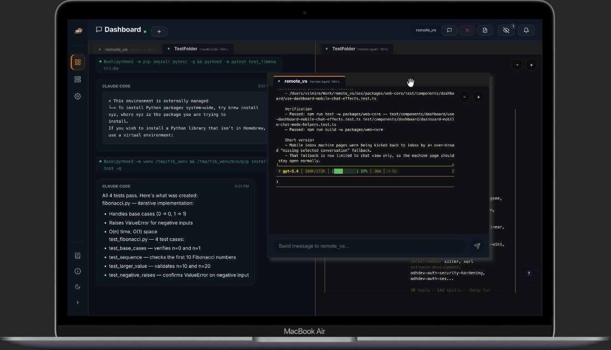
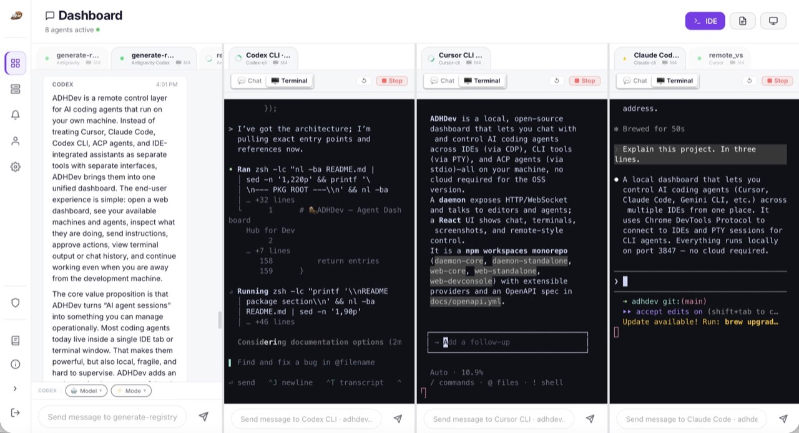
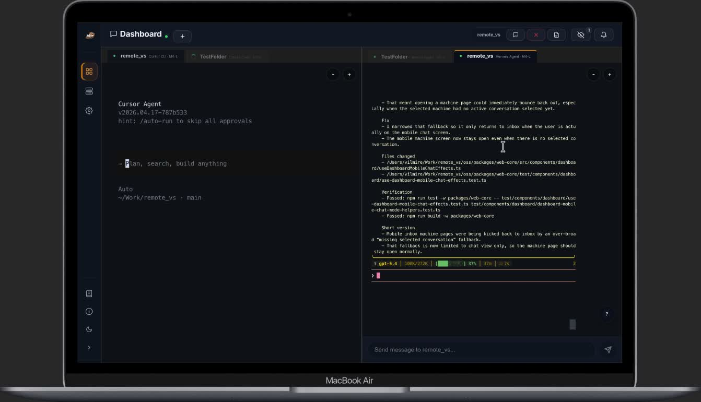
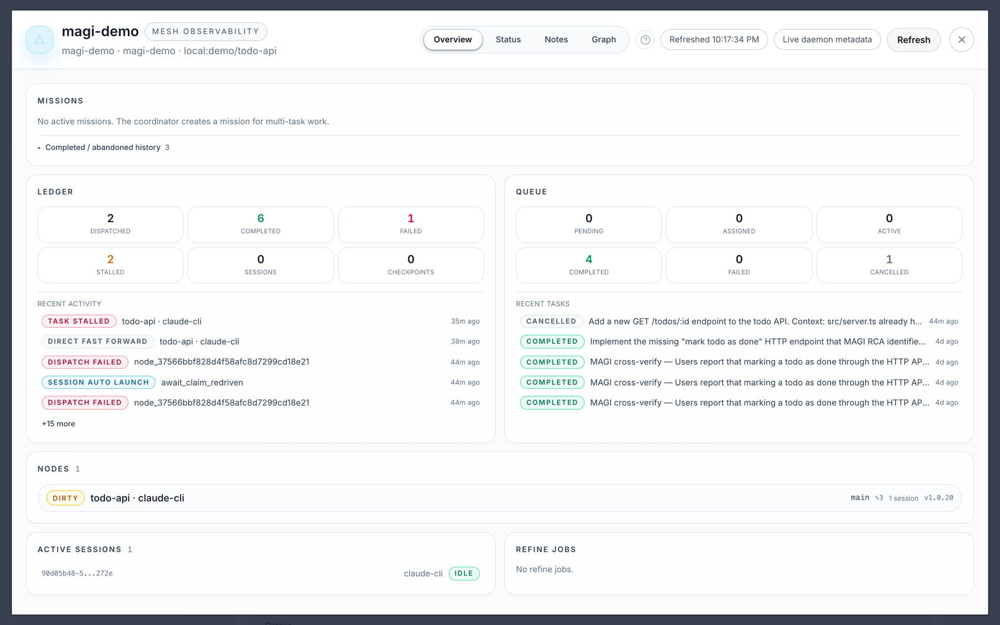
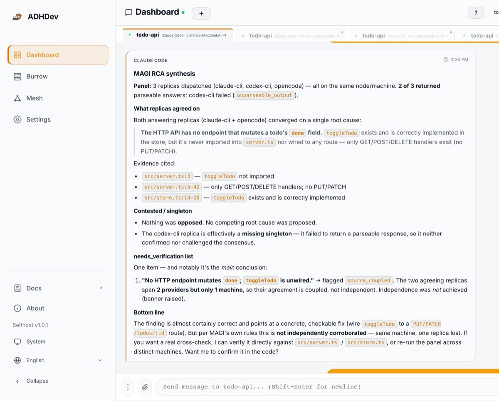
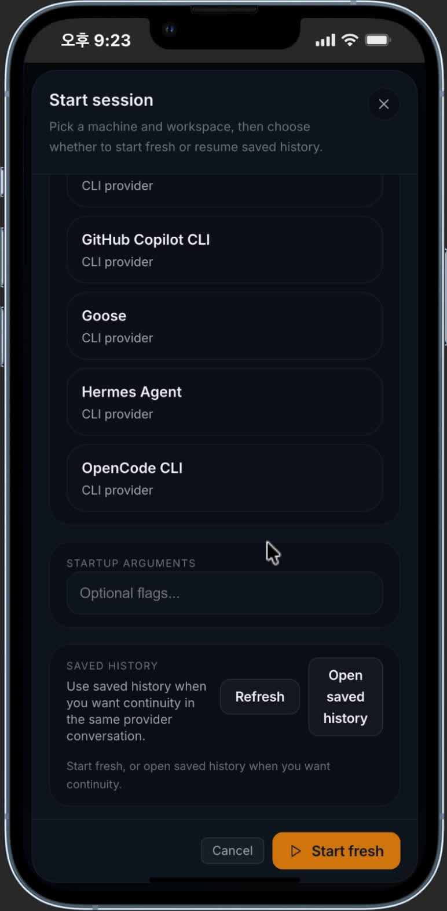

[English](README.md) | [한국어](README.ko.md)

# ADHDev

**웹에서 AI 코딩 에이전트를 제어하고, 스스로 `main`에 착지시키세요.**

[](https://www.npmjs.com/package/adhdev)
[](https://www.npmjs.com/package/@adhdev/daemon-standalone)
[](https://github.com/vilmire/adhdev/actions)
[](LICENSE)

AI 코딩 에이전트는 이제 장시간 실행되는 백그라운드 워커가 되었습니다. ADHDev는 그것들을 위한 컨트롤 플레인입니다. 웹 또는 모바일 대시보드에서 — 모든 머신에 걸쳐 — 에이전트 세션을 실행·감시·승인·조종하고, 완료된 작업을 `main`에 머지하는 무인 파이프라인에 수렴을 맡기세요.

**병렬로 실행하고, 우리가 착지합니다.** 워크트리와 머신에 태스크를 분산한 뒤, Refinery가 결과를 검증·fast-forward하여 홈에 착지시킵니다 — 머지 데이 숙취 없이.

웹사이트: **[adhf.dev](https://adhf.dev)** · 문서: **[docs.adhf.dev](https://docs.adhf.dev)**

<p align="center">
  
</p>

---

## ADHDev를 쓰는 이유

### 🌐 웹 우선 제어
에이전트는 로컬에서 실행되고, 당신은 어디서든 조종합니다. 대시보드는 진짜 컨트롤 서피스입니다 — 활성 세션을 검사하고, 채팅·터미널 상태를 읽고, 작업을 승인 또는 중단하고, 적절한 히스토리를 다시 열고, 브라우저나 휴대폰에서 다음 지시를 보냅니다. 터미널을 붙잡고 기다릴 필요가 없습니다.

<table>
  <tr>
    <td width="50%" align="center" valign="top">
      
    </td>
    <td width="50%" align="center" valign="top">
      
    </td>
  </tr>
</table>

### 🕸️ Repo Mesh — 진정한 멀티머신 병렬성
의존성이 있는 태스크를 큐에 넣고 코디네이터가 여유 용량을 가진 노드(노트북, 데스크탑, 빌드 서버)에 자동으로 디스패치하게 두세요. 이것은 한 호스트에 SSH로 접속하는 방식이 **아닌**, P2P 메시 위의 진정한 멀티머신 오케스트레이션입니다. 각 태스크는 별도의 워크트리에서 실행되므로 에이전트들이 서로를 방해하지 않습니다. 메시 엔진과 Refinery는 이 레포에 포함되어 있으며, 크로스-머신 디스패치는 클라우드 에디션에서 실행됩니다.

<p align="center">
  
</p>

### ⚡ 설계 기반 비동기 — 한 곳에 대화
당신은 한 곳에 대화합니다. 코디네이터가 모든 워커와 머신을 비동기로 오케스트레이션합니다 — 코디네이터가 이벤트를 기다리고, 당신은 기다릴 필요가 없습니다. 각 에이전트 창 앞에 앉아 완료 여부를 확인할 필요 없이, 단일 코디네이터에 작업을 넘기면 모든 워커를 병렬로 구동하고 완료·승인·상태 이벤트가 실제로 도착할 때만 반응합니다 — 폴링도, 블로킹 대기도 없습니다. 당신에게는 하나의 대화, 그 아래엔 논블로킹 이벤트 루프.

### 🚢 Refinery — `main`에 무인 착지
병렬성은 작업이 실제로 머지될 때만 효과가 있습니다. Refinery는 완료된 태스크를 레포 자체의 검증 게이트·패치 동등성 검사·서브모듈 인식 fast-forward 머지·자동 워크트리 정리로 수렴합니다 — 무인으로. 에이전트가 완료하면, Refinery가 착지시킵니다. 위 메시 보드가 전체 파이프라인을 실시간으로 보여줍니다: 원장의 `DIRECT FAST FORWARD` 항목이 착지 완료된 태스크이고, `REFINE JOBS`가 진행 중인 수렴을 추적합니다.

### 🧩 서브모듈 인식 수렴 — 실제 모노레포에서 작동
병렬 워크트리와 무인 머지는 git 서브모듈이 등장하는 순간 취약해집니다. ADHDev는 이 케이스를 정면으로 다룹니다 — 이 프로젝트 자체가 서브모듈 모노레포(루트 레포 + AGPL 엔진 + 프로바이더 카탈로그를 서브모듈로)이며, 매일 이 메시와 Refinery를 도그푸딩합니다. Refinery는 수렴 중 서브모듈을 일급 시민으로 처리합니다:

- **도달 가능성 게이트** — 루트 브랜치가 `main`에 착지하기 전, 참조된 서브모듈 커밋이 서브모듈의 `origin/main`에서 도달 가능한지 검증합니다. 불가능하면 해당 커밋이 게시될 때까지 태스크를 차단 상태로 유지합니다.
- **패치 동등성 감지** — 서브모듈 커밋이 리베이스되거나 스쿼시되어 SHA가 바뀐 경우에도, Refinery는 *내용*이 이미 착지했는지 판단하여 이중 머지나 잘못된 다이버전스 플래그를 방지합니다.
- **원자적 포인터 범프** — 서브모듈 포인터 범프는 루트 변경과 함께 수렴하여, 무인 머지 중 루트가 깨지거나 댕글링 서브모듈 커밋을 가리키는 일이 없습니다.

### 🔺 MAGI — 교차 검증 결과
독립적인 에이전트 관점으로 태스크를 수행하고 완료로 인정하기 전에 결과를 교차 확인하여, 하나의 자신감 있지만 틀린 답변이 통과되지 않도록 합니다. 위험도가 높은 변경사항에는 한 쌍 이상의 눈이 필요합니다.

<p align="center">
  
</p>

### 🔐 P2P 전송 (신뢰, 페이월 아님)
채팅·명령·스크린샷·원격 입력은 암호화된 WebRTC 데이터 채널을 통해 대시보드와 데몬 사이에서 직접 이동합니다. 서버는 시그널링과 경량 메타데이터만 처리합니다 — 작업 데이터는 다른 사람의 서버에 저장되지 않습니다. 이것은 설계의 신뢰 속성이며, 업셀이 아닙니다.

<p align="center">
  
</p>

---

## 설치

**권장 — `adhdev` CLI:**

```bash
npm install -g adhdev
adhdev standalone
```

**`http://localhost:3847`**을 여세요.

**standalone 패키지로 직접 셀프호스트:**

```bash
npm install -g @adhdev/daemon-standalone
adhdev-standalone
```

모든 것이 로컬 데몬으로 머신에서 실행되며 내장 대시보드가 포함됩니다 — standalone 경로에는 클라우드 계정이 필요하지 않습니다.

유용한 플래그:

```bash
adhdev standalone --host          # 동일 LAN의 다른 기기 접근 허용
adhdev standalone --port 8080     # 커스텀 포트
adhdev standalone --token mysecret # 스크립트/운영자 접근을 위한 토큰 인증
adhdev standalone --no-open       # 브라우저 자동 열기 비활성화
```

Standalone은 기본적으로 localhost 전용입니다. LAN 접근을 위해 `0.0.0.0`에 바인딩하는 경우, 토큰 인증이나 대시보드 비밀번호가 설정되지 않으면 대시보드가 경고를 표시합니다.

> **Windows 참고:** Windows + Node.js 24+는 현재 일반 시작/설치 경로에서 차단됩니다. Node.js 22.x 또는 문서에 설명된 PowerShell 설치 경로를 사용하세요.

정규 셀프호스트 문서:

- [셀프호스트 설정](docs/self-hosted/setup.md)
- [셀프호스트 구성](docs/self-hosted/configuration.md)
- [셀프호스트 로컬 API](docs/self-hosted/local-api.md)

---

## 지원 에이전트

ADHDev는 네 가지 프로바이더 카테고리를 통해 코딩 에이전트와 통신합니다 — `ide` (CDP), `extension` (CDP 웹뷰), `cli` (PTY), `acp` (stdio를 통한 Agent Client Protocol).

**CLI 에이전트** (PTY 구동, 대시보드에서 실행·제어):

| 에이전트 | 프로바이더 |
| --- | --- |
| Claude Code | `cli/claude-cli` |
| Codex CLI | `cli/codex-cli` |
| Cursor Agent | `cli/cursor-cli` |
| Google Antigravity CLI | `cli/antigravity-cli` |
| Hermes Agent | `cli/hermes-cli` |
| Kimi Code | `cli/kimi` |
| Opencode | `cli/opencode` |

**IDE** (Chrome DevTools Protocol 경유): Cursor, Google Antigravity, VS Code, VSCodium, Kiro, Windsurf, Trae, PearAI.

**IDE 익스텐션** (CDP 웹뷰): Claude Code (VS Code), Codex, Cline, Roo Code.

**ACP 에이전트** (stdio, Agent Client Protocol): 35개 내장 어댑터 — Gemini CLI, Qwen Code, Goose, GitHub Copilot, Cursor (ACP), Claude Agent, Codex CLI, Kimi CLI, Cline, Kilo, Junie, OpenHands 등.

> **내장 ≠ 검증됨.** ADHDev는 광범위한 인벤토리를 제공합니다. 카탈로그에 있다는 것은 통합이 존재한다는 의미이지, 엔드-투-엔드로 검증되었다는 의미가 아닙니다. 지원 수준은 다양합니다. 라이브 정책을 참조하세요:
>
> - [지원 프로바이더](https://docs.adhf.dev/reference/supported-providers)
> - [지원 IDE](https://docs.adhf.dev/reference/supported-ides)
> - [호환성 및 주의사항](https://docs.adhf.dev/guide/compatibility)

ADHDev는 에이전트의 API 키를 **관리하지 않습니다** — 각 도구가 자체 인증을 처리합니다. ADHDev는 설치 상태를 감지하고 오류를 표시합니다.

---

## Star 히스토리

[](https://star-history.com/#vilmire/adhdev&Date)

---

## 커뮤니티

- 💬 **Discord** — <!-- COMMUNITY: Discord invite link (pending, see LAUNCH-ASSETS-PREP) --> _(초대 링크 곧 공개)_
- 🐛 [Issues](https://github.com/vilmire/adhdev/issues)
- 🤝 [기여하기](CONTRIBUTING.md)
- 📋 [변경 로그](CHANGELOG.md)

---

## 이 레포에 포함된 것

이것은 오픈소스 셀프호스트 에디션(AGPL-3.0)입니다. 호스팅 클라우드 운영은 이 레포에 포함되지 않습니다. 셀프호스트는 세 가지 로컬 레이어로 구성됩니다:

1. `daemon-standalone`은 로컬 HTTP/WebSocket 서버를 제공하고 웹 UI를 서빙합니다.
2. `daemon-core`는 IDE, CLI, 익스텐션, ACP 통합을 관리합니다.
3. `session-host-daemon` (`adhdev-sessiond`)은 데몬 재시작 후에도 CLI 세션이 살아남을 수 있도록 장기 PTY 런타임을 소유합니다.

| 경로 | 목적 |
| --- | --- |
| `packages/daemon-core` | 공유 엔진: 프로바이더, CDP, 명령 라우팅, 세션/런타임 상태 |
| `packages/daemon-standalone` | 로컬 HTTP/WS 서버 및 번들 standalone UI |
| `packages/web-core` | 공유 React 페이지, 컴포넌트, 훅, 전송 추상화 |
| `packages/web-standalone` | Standalone 대시보드 앱 |
| `packages/web-devconsole` | 프로바이더/개발 진단 UI |
| `packages/session-host-core` | 세션 호스트 프로토콜, 클라이언트, 레지스트리, 링 버퍼, 레이블 |
| `packages/session-host-daemon` | 장기 PTY 런타임 소유 프로세스 |
| `packages/terminal-mux-*` | 로컬 터미널 멀티플렉서 스택 |
| `packages/terminal-render-web` | 브라우저 사이드 터미널 렌더링 지원 |
| `packages/ghostty-vt-node` | 런타임/멀티플렉서 레이어에서 사용하는 Ghostty VT 바인딩 |

### Standalone API 서피스

- `GET /api/v1/status` — sessions[] 배열이 신뢰의 근거
- `POST /api/v1/command`
- `GET /api/v1/runtime/:sessionId/snapshot`
- `GET /api/v1/runtime/:sessionId/events`
- `GET /api/v1/mux/:workspace/state`
- `POST /api/v1/mux/:workspace/control`
- `ws://localhost:3847/ws`

레퍼런스: [docs/openapi.yml](docs/openapi.yml) · [셀프호스트 API 문서](docs/self-hosted/local-api.md)

---

## 소스에서 개발

```bash
git clone https://github.com/vilmire/adhdev.git
cd adhdev
npm install
npm run build
npm run dev
```

유용한 워크스페이스 스크립트:

```bash
npm run dev:daemon
npm run dev:web
npm run dev -w packages/web-devconsole
```

---

## OSS vs 클라우드

| 기능 | OSS (셀프호스트) | 클라우드 |
| --- | :--: | :--: |
| 로컬 전용 대시보드 | ✅ | ✅ |
| Repo Mesh + Refinery 엔진 | ✅ | ✅ |
| LAN 외부 원격 접근 | ❌ | ✅ |
| 크로스 머신 메시 (P2P, SSH 없음) | ❌ | ✅ |
| API 키 및 호스팅 웹훅 | ❌ | ✅ |
| OAuth / 계정 시스템 | ❌ | ✅ |
| 푸시 알림 | ❌ | ✅ |
| 팀 / 공유 기능 | ❌ | ✅ |

---

## 라이선스

AGPL-3.0-or-later. [LICENSE](LICENSE)를 참조하세요.
