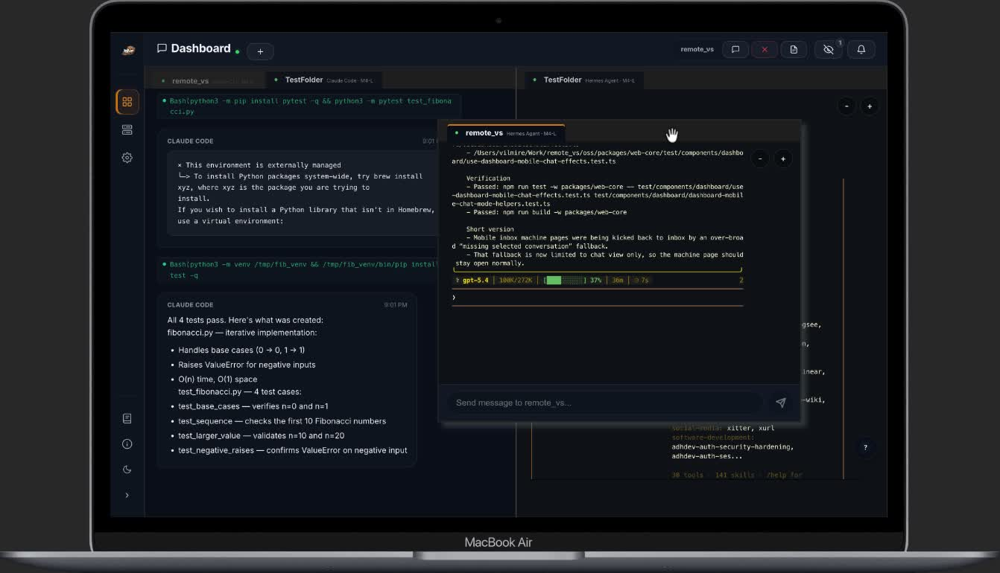
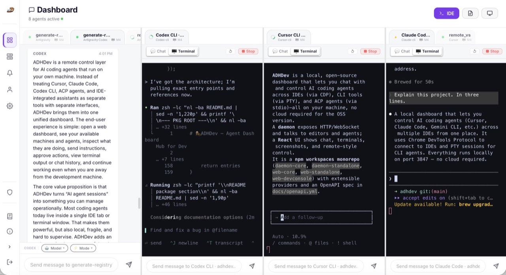
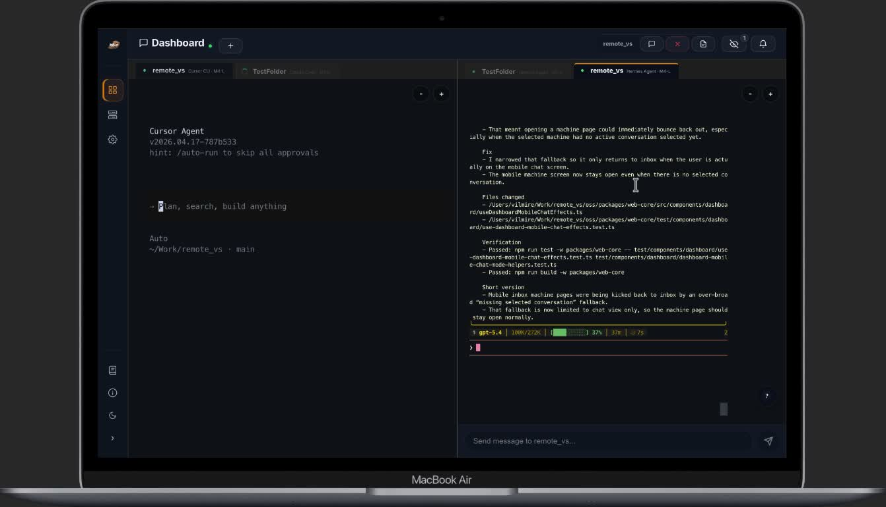
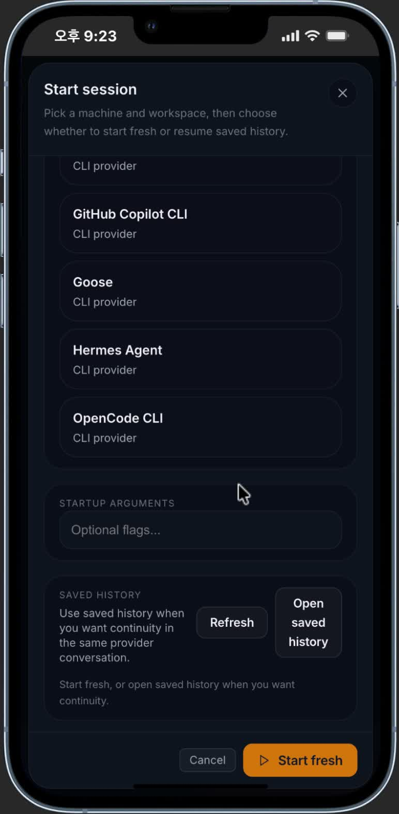

# ADHDev Self-Hosted

[](https://www.npmjs.com/package/@adhdev/daemon-standalone)
[](https://github.com/vilmire/adhdev/actions)
[](LICENSE)

ADHDev Self-Hosted is the local command center for AI coding agents running in your IDEs, CLIs, and hosted runtimes. Watch active sessions, inspect chat and terminal state, approve or nudge work, and reopen saved history from the dashboard — all on your own machine, with no cloud account and no hosted control plane required.

Why people open it:

- One dashboard for Cursor, VS Code, Claude Code, Codex, Gemini CLI, and long-lived hosted runtimes
- One place to inspect live context before you approve, interrupt, or continue work
- One self-hosted stack you can keep local by default, then expose to your LAN only when you choose

This repo contains the open-source, self-hosted edition:

- the standalone local server and dashboard
- the shared daemon/runtime packages used by both standalone and cloud
- the session-host and terminal-mux stack for hosted CLI runtimes

Hosted cloud operations are not part of this repository.

## Screenshots

Real product shots from the landing page, because a README for a dashboard should actually show the dashboard:

<p align="center">
  
</p>
<p align="center"><em><strong>Command center:</strong> keep multiple agent sessions visible, reconfigure the live workspace, and stay in control without tab-hopping across tools.</em></p>

<table>
  <tr>
    <td width="50%" valign="top">
      
      <strong>Desktop detail</strong><br />
      Open one session and see the full working surface at once: conversation, code, terminal output, and current agent state.
    </td>
    <td width="50%" valign="top">
      
      <strong>Done alerts</strong><br />
      Step away, let the session keep running, and come back only when the dashboard tells you the work is ready.
    </td>
  </tr>
</table>

<p align="center">
  
</p>
<p align="center"><em><strong>Mobile resume:</strong> reopen the exact saved thread from your phone instead of starting a fresh scratch chat.</em></p>

## What It Runs

ADHDev Self-Hosted is built around three local layers:

1. `daemon-standalone` exposes a local HTTP/WebSocket server and serves the web UI.
2. `daemon-core` manages IDE, CLI, extension, and ACP integrations.
3. `session-host-daemon` (`adhdev-sessiond`) owns long-lived PTY runtimes so CLI sessions can survive daemon restarts.

Everything runs on your machine by default. There is no cloud account requirement for the standalone path.

## Quick Start

Recommended path:

```bash
npm install -g adhdev
adhdev standalone
```

Direct standalone package:

```bash
npm install -g @adhdev/daemon-standalone
adhdev-standalone
```

Open `http://localhost:3847`.

Useful flags:

```bash
adhdev standalone --host
adhdev standalone --port 8080
adhdev standalone --token mysecret
adhdev standalone --no-open
adhdev standalone --dev
```

What those choices mean in practice:

- plain `adhdev standalone` = localhost-only dashboard on this machine
- `--host` = other devices on the same LAN can open it too
- `--token` = best for scripts, curl, and operator-style access
- dashboard password = best for normal browser users who should see a login prompt
- `--host` with no token and no password = warning-first LAN exposure, not a hard block

Standalone stays localhost-only by default. If you bind to `0.0.0.0` for LAN access, the dashboard warns when neither token auth nor a dashboard password is configured.

The standalone UI already includes both settings surfaces:

- `Settings` → `Dashboard Security`
  - enable password
  - update/change password
  - disable password
- `Settings` → `Network Access`
  - save default localhost-only vs all-interfaces bind mode for future launches
- `Settings` → `Appearance` → `Fonts`
  - standalone-only overrides for chat text, markdown/code blocks, and terminal/tool rows
  - saved alongside standalone network preferences under `~/.adhdev/standalone-network.json`

Current standalone UX defaults:

- ordinary CLI and ACP launches start fresh by default
- use `Open saved history` when you want continuity in the same provider conversation
- hosted runtime recovery is a separate interruption flow, not part of the ordinary new-session CTA
- if the local dashboard drops its websocket connection, the banner now exposes `Reconnect now`

Canonical self-hosted docs:

- [Self-hosted setup](docs/self-hosted/setup.md)
- [Self-hosted configuration](docs/self-hosted/configuration.md)
- [Self-hosted local API](docs/self-hosted/local-api.md)

Windows note:

- Windows + Node.js 24+ is currently blocked for normal startup/install paths.
- Use Node.js 22.x, or use the PowerShell installer path described in the docs.

## Repository Layout

| Path | Purpose |
| --- | --- |
| `packages/daemon-core` | Shared engine: providers, CDP, command routing, session/runtime state |
| `packages/daemon-standalone` | Local HTTP/WS server and bundled standalone UI |
| `packages/web-core` | Shared React pages, components, hooks, and transport abstractions |
| `packages/web-standalone` | Standalone dashboard app |
| `packages/web-devconsole` | Provider/dev diagnostics UI |
| `packages/session-host-core` | Session-host protocol, client, registry, ring buffer, labels |
| `packages/session-host-daemon` | Long-lived PTY runtime owner process |
| `packages/terminal-mux-*` | Local terminal mux stack |
| `packages/terminal-render-web` | Browser-side terminal rendering support |
| `packages/ghostty-vt-node` | Ghostty VT bindings used by runtime/mux layers |

## Provider Inventory

ADHDev ships a broad built-in inventory of IDE, extension, CLI, and ACP integrations, including 35 ACP adapters.

Important distinction:

- built-in means the integration exists in the shipped inventory
- verified means it has explicit validation evidence

Do not treat inventory presence as blanket support. Current verification policy lives here:

- [Supported Providers](https://docs.adhf.dev/reference/supported-providers)
- [Supported IDEs](https://docs.adhf.dev/reference/supported-ides)
- [Compatibility & Caveats](https://docs.adhf.dev/guide/compatibility)

## Standalone API Surface

The standalone server currently exposes:

- `GET /api/v1/status`
- `POST /api/v1/command`
- `GET /api/v1/runtime/:sessionId/snapshot`
- `GET /api/v1/runtime/:sessionId/events`
- `GET /api/v1/mux/:workspace/state`
- `GET /api/v1/mux/:workspace/socket-info`
- `POST /api/v1/mux/:workspace/control`
- `GET /api/v1/mux/:workspace/events`
- `ws://localhost:3847/ws`

Canonical runtime contract:

- `GET /api/v1/status` and its `sessions[]` array are the source of truth
- runtime targeting should use raw `targetSessionId`
- older per-surface projections should be treated as convenience views, not the canonical model

Reference:

- [docs/openapi.yml](docs/openapi.yml)
- [Self-hosted API docs](docs/self-hosted/local-api.md)

## Session Host

Hosted CLI runtimes are managed through `adhdev-sessiond`.

Key properties of the current design:

- PTY ownership is separated from the main daemon process
- CLI sessions can reconnect after daemon restarts
- write ownership is explicit and single-owner
- diagnostics and recovery actions are exposed through the daemon control plane and standalone UI

See:

- [Self-hosted setup](docs/self-hosted/setup.md)
- [Self-hosted local API](docs/self-hosted/local-api.md)
- [Self-hosted session host](docs/self-hosted/session-host.md)
- [Compatibility & caveats](https://docs.adhf.dev/guide/compatibility)

## Development

From source:

```bash
git clone https://github.com/vilmire/adhdev.git
cd adhdev
npm install
npm run build
npm run dev
```

Useful workspace scripts:

```bash
npm run dev:daemon
npm run dev:web
npm run dev -w packages/web-devconsole
```

## Documentation

- [Self-hosted setup](docs/self-hosted/setup.md)
- [Self-hosted local API](docs/self-hosted/local-api.md)
- [Supported providers](https://docs.adhf.dev/reference/supported-providers)
- [Contributing](CONTRIBUTING.md)
- [Changelog](CHANGELOG.md)

## Cloud Comparison

| Feature | OSS | Cloud |
| --- | :--: | :--: |
| Local-only dashboard | ✅ | ✅ |
| Remote access outside LAN | ❌ | ✅ |
| Multi-machine management | ❌ | ✅ |
| API keys and hosted webhooks | ❌ | ✅ |
| OAuth / account system | ❌ | ✅ |
| Push notifications | ❌ | ✅ |
| Team / sharing features | ❌ | ✅ |

## License

AGPL-3.0-or-later. See [LICENSE](LICENSE).
