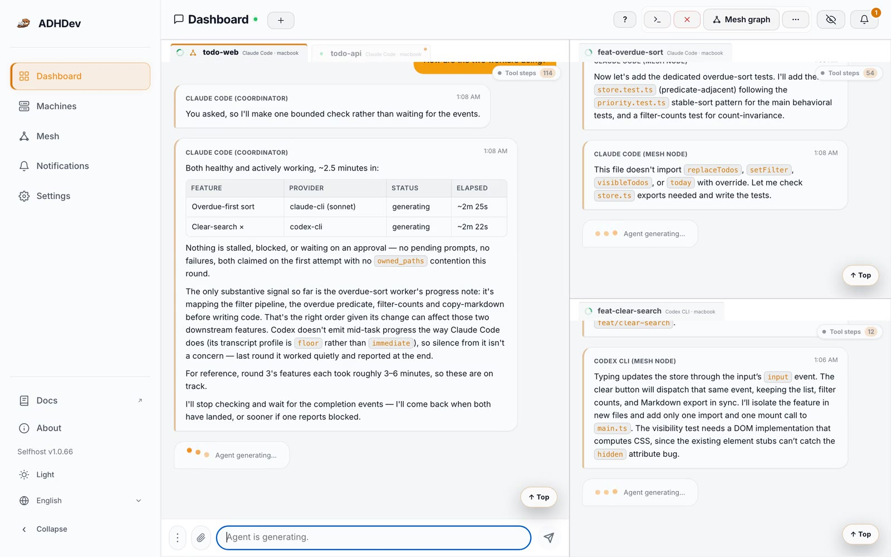
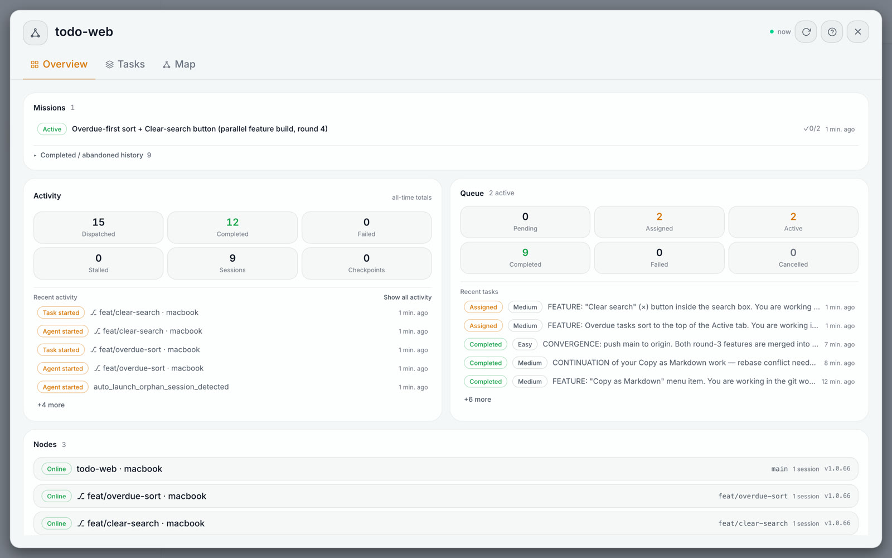
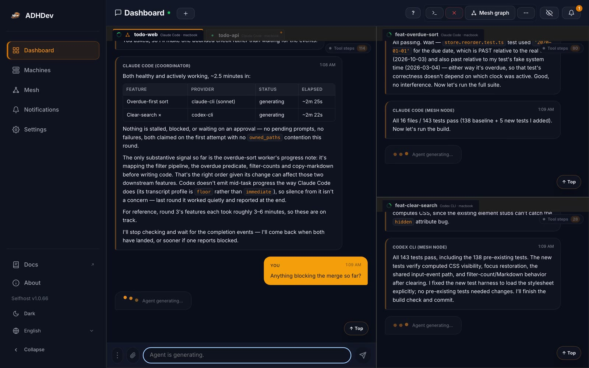
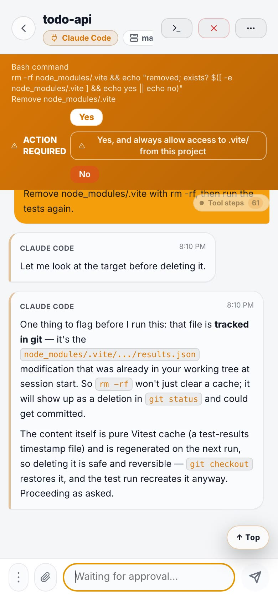
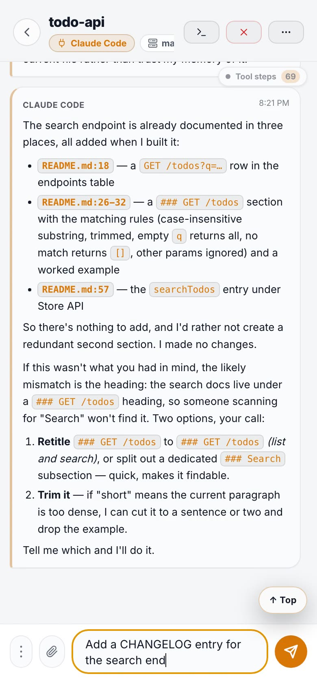

[English](README.md) | [한국어](README.ko.md)

# ADHDev

**The control plane for your coding agents: every agent on every machine in one view, one shared task queue, and only work that passes your tests reaches `main`.**

[](https://github.com/vilmire/adhdev/stargazers)
[](https://www.npmjs.com/package/adhdev)
[](https://www.npmjs.com/package/@adhdev/daemon-standalone)
[](https://github.com/vilmire/adhdev/actions)
[](LICENSE)

AI coding agents have become long-running background workers. ADHDev is the control plane for them: launch, watch, approve, and steer agent sessions from a web or mobile dashboard — Claude Code, Codex, Kimi, Cursor CLI, Antigravity CLI side by side, across every machine you own — and hand off convergence to an unattended pipeline that merges finished work into `main`.

**Parallel agents without the collisions.** Every task runs in its own git worktree; the Refinery gates, verifies, and rebases finished work onto main, merging only if main hasn't moved — no merge-day hangover.

Website: **[adhf.dev](https://adhf.dev)** · Docs: **[docs.adhf.dev](https://docs.adhf.dev)**

**Try it in one command:** `npx @adhdev/daemon-standalone`, then open http://localhost:3847.

<p align="center">
  
</p>

**The loop:** describe a task in chat → the coordinator files it, tags it, queues it → an idle machine claims it into a fresh worktree → your repo's own gates decide → rebased onto `main` and merged only if `main` hasn't moved, worktree gone. Your phone only buzzed if something needed approving.

ADHDev is built that way. In the private monorepo where ADHDev is developed — this engine is published from it as a submodule — roughly one in six `main` commits is an `Auto-merge via Refinery` commit: work that an agent finished, the repo's own gates approved, and Refinery landed without a human running `git merge`. That history lives in the upstream monorepo, so this public mirror's own log won't show those merge commits.

---

## Why ADHDev

### 🕸️ Repo Mesh — true multi-machine parallelism
(A single-machine mesh runs fully local; spreading it across machines needs the cloud edition.) Enqueue tasks with dependencies and let a coordinator dispatch them to whichever node has spare capacity — your laptop, a desktop, a build box. This is genuine multi-machine orchestration over a P2P mesh, **not** SSH into one host. Each task runs in its own worktree so agents never step on each other. The mesh and Refinery engine ships in this repo; cross-machine dispatch runs on the cloud edition.

A mesh is bound to one git repository and owns the moving parts you'd otherwise coordinate by hand:

| | |
| --- | --- |
| **Task queue** | Pull-based. `pending → assigned → completed/failed`, with `depends_on` ordering and retries. Idle nodes claim work themselves — no push scheduler to get out of sync. |
| **Missions** | A goal that groups many tasks, so a restarted coordinator picks up where the last one left off instead of re-queuing everything. |
| **Worktree nodes** | An isolated branch checkout per parallel task, bootstrapped automatically (install, native rebuilds, gitignored build outputs) before any work is dispatched to it. |
| **Append-only ledger** | Every dispatch, completion, failure, stall, and checkpoint as an append-only record in the mesh's local SQLite store — the audit trail that makes "what actually happened" answerable after the fact. |
| **Operating notes** | Lessons recorded at runtime (a provider quirk, a recovery procedure) are injected into every future coordinator prompt, so knowledge outlives the session that learned it. |
| **Live-state prompt** | The coordinator's system prompt isn't static text — at launch it's a render of live mesh state (node health, active mission, recent failures, accumulated notes), and at runtime events are injected into its session instead of it polling. |
| **Difficulty routing** | Map easy work to cheap models and hard work to expensive ones with deep thinking, per node capability — the token bill scales with difficulty, not with task count. |
| **Task chaining** | Chain tasks with `depends_on`: a dependent waits until its predecessors complete, then receives their completion summaries as an "Upstream results" appendix. A failed or cancelled predecessor holds (or, by mesh policy, cancels) the downstream chain and notifies the coordinator. `mesh_enqueue_batch` enqueues several already-confirmed tasks in one atomic call. |

<p align="center">
  
</p>

### 🚢 Refinery — unattended landing on `main`
Parallelism only pays off if the work actually merges. The Refinery converges finished tasks with per-repo validation gates, patch-equivalence checks, submodule-aware rebase-and-merge (only if main hasn't moved), and automatic worktree cleanup — unattended. Agents finish; the Refinery lands them. The mesh board above surfaces the pipeline live: tasks moving through the queue, refine jobs while convergence is in flight, and every dispatch, completion, and stall in the activity feed.

### 🧩 Submodule-aware convergence — works on real monorepos
Parallel worktrees and unattended merges get fragile the moment git submodules enter the picture. ADHDev handles that case head-on — this very project is a submodule monorepo (a root repo plus the AGPL engine and provider catalog as submodules), and we dogfood the mesh and Refinery on it every day. The Refinery treats submodules as first-class during convergence:

- **Reachability gate** — before a root branch lands on `main`, it verifies the referenced submodule commits are reachable from the submodule's `origin/main`; if not, the task is held as blocked until those commits are published.
- **Patch-equivalence detection** — when a submodule commit is rebased or squashed and its SHA changes, the Refinery still determines whether the *content* already landed, so it won't double-merge or falsely flag a divergence.
- **Atomic pointer bumps** — the submodule pointer bump converges together with the root change, so an unattended merge never leaves the root pointing at a broken or dangling submodule commit.

### ⚡ Async by design — you talk to one place
You talk to one place. The coordinator orchestrates every worker and machine asynchronously — it waits on events, you don't. No session babysitting. Instead of sitting in front of each agent window watching for it to finish, you hand work to a single coordinator that drives all the workers in parallel and reacts only when a completion, approval, or status event actually arrives — no polling, no blocking waits. One conversation for you; a non-blocking event loop underneath.

### 🌐 See and steer every session
Your agents run locally; you watch and drive them from any browser. The dashboard is a real control surface — inspect active sessions, read chat and terminal state, approve or interrupt work, reopen the right history, and send the next instruction from a browser or your phone. No terminal babysitting. Approval pushes carry the start of the command itself, because approving `rm -rf build/` and approving `git push --force` deserve different reaction times: the push arrives → tap it → approve in one tap (push-to-phone ships with the cloud edition).

<table>
  <tr>
    <td width="50%" align="center" valign="top">
      
    </td>
    <td width="50%" align="center" valign="top">
      
    </td>
  </tr>
</table>

### 🔺 Multi-perspective review
For a read-only investigation that matters — a bug RCA, a design review, an audit — ask the coordinator for a second opinion: it sends the same question to 2–3 workers on different providers, waits for their reports, and lays out where they agree, where they disagree, and which claims only one of them made. High agreement is not the same as being right — the same model with the same context repeats the same mistake — so the disagreements are the part worth reading.

### 🔐 P2P transport (trust, not a paywall)
Chat, commands, screenshots, and remote input travel over an encrypted WebRTC data channel directly between your dashboard and your daemon. The server handles sign-in, signaling and lightweight metadata, plus one deliberate exception: on the cloud edition it receives the approval prompt (the command and button labels) to build the push notification, and the push shows up to 80 characters of it. Chat, terminal output and your code don't sit on someone else's box. It's a trust property of the design, not an upsell.

<p align="center">
  
</p>

---

## How it works

ADHDev doesn't replace your agents or spawn its own — it **attaches to the ones already installed on your machine** and gives them a control surface.

```
   browser / phone
         │  chat, commands, screenshots, remote input
         ▼
   ┌───────────────┐        PTY          ┌──────────────────────┐
   │    daemon     │────────────────────▶│ Claude Code, Codex,  │
   │ (your machine)│◀────────────────────│ Cursor CLI, …        │
   │               │        CDP          ├──────────────────────┤
   │  · providers  │────────────────────▶│ Cursor, VS Code,     │
   │  · sessions   │                     │ Antigravity, …       │
   │  · mesh/queue │                     └──────────────────────┘
   │  · Refinery   │
   └───────────────┘
         │
         └── git worktrees ── one isolated checkout per parallel task
```

- **The daemon owns the integrations.** Three provider categories: `cli` (PTY), `ide` (Chrome DevTools Protocol), `extension` (CDP webview).
- **Long-lived runtimes are a separate process.** `adhdev-sessiond` owns the PTYs, so your CLI sessions survive a daemon restart or upgrade.
- **Self-hosted talks straight to the daemon** over HTTP + WebSocket on `localhost:3847`. In the cloud edition the same data rides a WebRTC data channel browser↔daemon, with the server only doing signaling.

### What happens when you queue a task

```
mesh_enqueue_task  →  SQLite queue (pending)
                   →  an idle node claims it (assigned)
                   →  worker agent runs in its own git worktree
                   →  completed / failed  →  append-only ledger
                   →  Refinery: repo's own gates → patch equivalence → rebase → merge (main unchanged) → cleanup
```

Four properties that shape everything else:

1. **The coordinator routes, it doesn't implement.** It orchestrates mesh tools instead of reading and editing code itself, so its context stays small and its ownership survives daemon restarts.
2. **Nothing polls.** Worker completion, approval, and refine reports are delivered straight into the coordinator's session as they happen — via a structured `report_completion` call, not a screen-scrape. You wait on events; you don't ask for status in a loop.
3. **Git is the proof, not the agent's word.** "Done" is verified with real git state and commit checkpoints, not with a worker claiming success.
4. **Ambiguity stops the pipeline.** The Refinery never force-pushes; anything it can't decide is held for a human instead of merged.

> Deeper: [Repo Mesh developer guide](docs/repo-mesh/DEVELOPER.md) · [session-host](docs/self-hosted/session-host.md)

---

## Install

**Requirements:** Node.js 20 or newer (22 LTS recommended; on Windows use 22.x — see the note below), git, and at least one coding agent already installed and authenticated — ADHDev drives the CLIs you already use.

**Recommended — the `adhdev` CLI:**

```bash
npm install -g adhdev
adhdev standalone
```

Open **`http://localhost:3847`**.

**Self-host directly with the standalone package:**

```bash
npm install -g @adhdev/daemon-standalone
adhdev-standalone
```

Everything runs on your machine as a local daemon with an embedded dashboard — no cloud account required for the standalone path. Both packages install an `adhdev` command, so install one or the other, not both.

**Cloud edition (several machines, push notifications):**

```bash
curl -fsSL https://adhf.dev/install | sh      # macOS / Linux
irm https://adhf.dev/install.ps1 | iex         # Windows (PowerShell)
adhdev setup                                   # sign in, then open https://adhf.dev
```

Useful flags:

```bash
adhdev standalone --host 0.0.0.0  # allow other devices on the same LAN
adhdev standalone --port 8080     # custom port
adhdev standalone --token mysecret # token auth for scripts / operator access
adhdev standalone --no-open       # don't auto-open the browser
adhdev standalone --dev           # enable the DevServer API (:19280) to debug and test providers
adhdev-standalone --public <dir>  # (standalone package) serve a custom web dashboard build
```

Standalone stays localhost-only by default. If you bind to `0.0.0.0` for LAN access, the dashboard warns when neither token auth nor a dashboard password is configured.

> **Windows note:** Windows + Node.js 24+ is currently blocked for normal startup/install paths. Use Node.js 22.x, or the PowerShell installer: `irm https://adhf.dev/install.ps1 | iex` ([docs](https://docs.adhf.dev)).

Canonical self-hosted docs:

- [Self-hosted setup](docs/self-hosted/setup.md)
- [Self-hosted configuration](docs/self-hosted/configuration.md)
- [Self-hosted local API](docs/self-hosted/local-api.md)

### First five minutes

1. **Start the daemon** — `adhdev standalone`, then open `http://localhost:3847`. The dashboard detects which agents are installed on this machine.
2. **Launch a session.** Pick a provider (say Claude Code), pick a working directory, and start it. You now have a real agent session you can drive from chat *or* watch as a raw terminal — toggle between the two.
3. **Send work and walk away.** Type a task. When the agent hits a permission prompt, it shows up as an approval in the dashboard's activity inbox instead of blocking a terminal you're not looking at. (Push-to-phone for those approvals is a cloud feature.)
4. **Paste a screenshot into the chat** when a description isn't enough — it goes into the agent's context directly.
5. **Try the mesh on one machine.** Open `/mesh`, create a mesh bound to your repo, and clone a worktree node. Queue a task to it and watch the ledger: dispatch → completion → Refinery → rebase and merge into `main`. This all works self-hosted; only crossing to a *second machine* needs the cloud edition.

Stuck? The [self-hosted setup guide](docs/self-hosted/setup.md) covers ports, LAN exposure, and provider detection problems.

---

## Supported Agents

ADHDev talks to coding agents through three provider categories — `ide` (CDP), `extension` (CDP webview), and `cli` (PTY).

**CLI agents** (PTY-driven, launched and controlled from the dashboard):

| Agent | Provider |
| --- | --- |
| Claude Code | `cli/claude-cli` |
| Codex CLI | `cli/codex-cli` |
| Cursor Agent | `cli/cursor-cli` |
| Google Antigravity CLI | `cli/antigravity-cli` |
| Grok CLI | `cli/grok-cli` |
| Kimi Code | `cli/kimi` |
| Opencode | `cli/opencode` |

**IDEs** (via Chrome DevTools Protocol): Cursor, Google Antigravity, VS Code, VSCodium, Kiro, Windsurf, Trae, PearAI.

**IDE extensions** (CDP webview): Claude Code (VS Code), Codex, Cline, Roo Code.

> **Built-in ≠ verified.** ADHDev ships a broad inventory; presence in the catalog means the integration exists, not that every one has been validated end-to-end. Support levels vary. See the live policy:
>
> - [Supported Providers](https://docs.adhf.dev/reference/supported-providers)
> - [Supported IDEs](https://docs.adhf.dev/reference/supported-ides)
> - [Compatibility & Caveats](https://docs.adhf.dev/guide/compatibility)

ADHDev does **not** manage API keys for your agents — each tool handles its own auth. ADHDev detects install status and surfaces errors.

### Add your own agent

Providers are data, not code you have to fork. A provider is a versioned manifest (`provider.v1.json`) plus scripts describing how to detect the tool, launch it, parse its output into chat turns, and recognise its approval prompts. Drop one in `~/.adhdev/providers/` and the dashboard picks it up — your override wins over the built-in of the same name, so you can fix a broken parser locally without waiting for a release.

- Verification tiers are explicit: **Verified / Partial / Unverified**. "Built-in" only means the integration exists.
- Guides: [Supported Providers](https://docs.adhf.dev/reference/supported-providers) · [Custom providers guide](https://docs.adhf.dev/guide/custom-providers)

If you get an agent working that isn't in the catalog, that's the most useful contribution you can make — open it against [vilmire/adhdev-providers](https://github.com/vilmire/adhdev-providers). Core pull requests here require signing the CLA (the bot prompts you).

---

## Star History

[](https://star-history.com/#vilmire/adhdev&Date)

---

## Community

- 💬 [Discord](https://discord.gg/WJD3tCfBzk)
- 🐛 [Issues](https://github.com/vilmire/adhdev/issues)
- 🤝 [Contributing](CONTRIBUTING.md)
- 📋 [Changelog](CHANGELOG.md)

---

## What's in This Repo

This is the open-source, self-hosted edition (AGPL-3.0). Hosted cloud operations are not part of this repository. Self-hosted is built around three local layers:

1. `daemon-standalone` exposes a local HTTP/WebSocket server and serves the web UI.
2. `daemon-core` manages IDE, CLI, and extension integrations.
3. `session-host-daemon` (`adhdev-sessiond`) owns long-lived PTY runtimes so CLI sessions survive daemon restarts.

| Path | Purpose |
| --- | --- |
| `packages/daemon-core` | Shared engine: providers, CDP, command routing, session/runtime state |
| `packages/daemon-standalone` | Local HTTP/WS server and bundled standalone UI |
| `packages/web-core` | Shared React pages, components, hooks, and transport abstractions |
| `packages/web-standalone` | Standalone dashboard app |
| `packages/session-host-core` | Session-host protocol, client, registry, ring buffer, labels |
| `packages/session-host-daemon` | Long-lived PTY runtime owner process |
| `packages/terminal-mux-*` | Local terminal mux stack |
| `packages/terminal-render-web` | Browser-side terminal rendering support |
| `packages/ghostty-vt-node` | Ghostty VT bindings used by runtime/mux layers |

### Standalone API surface

- `GET /api/v1/status` — sessions[] array is the source of truth
- `POST /api/v1/command`
- `GET /api/v1/runtime/:sessionId/snapshot`
- `GET /api/v1/runtime/:sessionId/events`
- `GET /api/v1/mux/:workspace/state`
- `POST /api/v1/mux/:workspace/control`
- `ws://localhost:3847/ws`

Reference: [Self-hosted API docs](docs/self-hosted/local-api.md)

---

## Develop from source

```bash
git clone https://github.com/vilmire/adhdev.git
cd adhdev
npm install
npm run build
npm run dev
```

Useful workspace scripts:

```bash
npm run dev:daemon
npm run dev:web
```

---

## OSS vs Cloud

The engine is open source. What the cloud adds is a **reach layer**: accounts, more than one machine, internet-wide remote access, and push.

| | OSS (self-hosted) | Cloud ([adhf.dev](https://adhf.dev)) |
| --- | :--: | :--: |
| Dashboard | `localhost:3847` | `adhf.dev`, any browser or phone |
| Account required | ❌ no auth | OAuth (GitHub / Google) |
| Machines | **1** | 1 / 2 / 5 by plan |
| Reach | localhost, or your LAN with `--host` | **anywhere** (P2P WebRTC + TURN for locked-down networks) |
| Every provider (CLI / IDE / extension) | ✅ | ✅ |
| Repo Mesh, Refinery, worktree nodes | ✅ **single-machine mesh runs fully local** | ✅ |
| Mesh **across machines** | ❌ (no cross-machine relay) | ✅ |
| Push notifications (approval / completion / error) | ❌ | ✅ |
| Hosted REST API + API keys | ❌ (local API only) | ✅ |
| Price | free, no quotas | Free / Pro / Ultra |

If you only drive one machine and stay on your own network, self-hosted gives you everything except push notifications and the cross-machine mesh — no quotas. The cloud exists for the moment you add a second machine or want to reach your agents from outside the house.

---

## License

AGPL-3.0-or-later. See [LICENSE](LICENSE).
